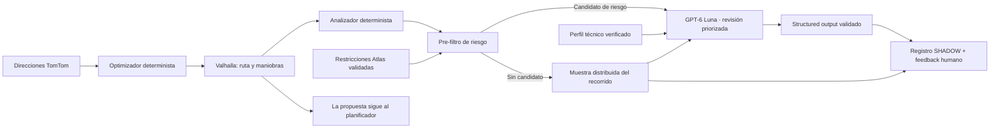

# Atlas Route Intelligence V1

## Estado y objetivo

La primera entrega funciona en modo `SHADOW`. TomTom resuelve direcciones, el optimizador determinista ordena paradas, Valhalla calcula el recorrido y Ferrostar conserva la navegación del conductor. Route Intelligence intenta revisar con OpenAI cada propuesta válida y registra la evaluación sin modificar el trazado, bloquearlo ni certificar que sea seguro. El 100% se refiere a cobertura de evaluación de las propuestas que llegan al endpoint con modo habilitado; no garantiza una mejora positiva en una ruta que ya sea la mejor opción verificable.

El límite es deliberado: `LEGAL`, `ROUTABLE`, `PHYSICALLY_POSSIBLE` y `OPERATIONALLY_REASONABLE` son propiedades distintas. Una respuesta del auditor nunca demuestra por sí sola las cuatro.

## Arquitectura

`supabase/functions/atlas-route-intelligence` es una Edge Function independiente. Usa la API Responses con `store: false`, timeout de 10 segundos y structured output. La clave OpenAI existe solo en servidor. No se importa código de Psicolaboral ni se altera su proveedor. Se usa llamada HTTP directa en Deno: la evaluación del SDK `@openai/agents` encontró incompatibilidad entre su requisito actual de Deno y el runtime de Edge Functions de Supabase; no se instala un runtime ni se agrega una plataforma para justificar el SDK.

## Evidencia y comportamiento

- El analizador normaliza tipo de maniobra, bearings, ángulo, nombre vial y coordenadas que entrega Valhalla.
- Carriles, ancho, sentido, tráfico y restricciones permanecen desconocidos salvo que Atlas tenga evidencia validada. No se infieren dimensiones.
- El pre-filtro centraliza umbrales. Si encuentra riesgos, el modelo recibe hasta 20 maniobras priorizadas; si no encuentra, igualmente se llama al modelo con una muestra distribuida de hasta 20 maniobras de todo el recorrido. La respuesta informa cuántas maniobras revisó y el alcance usado.
- La API recibe el perfil de equipo opcional. Solo se considera verificado si un administrador entrega tipo y dimensiones críticas desde una fuente confirmada. Sin perfil verificado, `APPROVE` se transforma en `INSUFFICIENT_EVIDENCE`.
- Las restricciones operacionales se guardan como `PROPOSED`; una segunda acción explícita de un superadministrador puede validarlas. Solo filas `VALIDATED`, vigentes, compatibles por contrato/tipo y cercanas a la maniobra se incluyen en la auditoría.
- Datos de texto de mapas se consideran no confiables. El modelo no recibe herramientas que escriban reglas, cambien rutas o creen despachos.
- Si OpenAI, el perfil o la base de restricciones falla, el planificador vial continúa; el intento queda identificado como error/incompleto cuando se puede persistir. No se contabiliza como evaluación IA exitosa.
- Una propuesta sin alertas visibles no equivale a aprobación operacional. Sin candidatos de riesgo, se envía la muestra distribuida al modelo; un `APPROVE` solo describe la evidencia entregada y nunca certifica la ruta.

## Seguridad y persistencia

Migración `20261008004912_atlas_route_intelligence_shadow.sql` agrega perfiles de ruta, ejecuciones y feedback append-only, restricciones con estado y eventos de resolución. Todas las tablas tienen RLS y solo exponen lectura a superadministradores; escrituras usan RPC `SECURITY DEFINER` que comprueban `auth.uid()` y el rol actual. `anon` y DML directo quedan revocados. Los resultados/modelos/versiones/uso se guardan con clave idempotente; la evidencia mantiene límites de tamaño.

El modo se controla en Supabase Edge Function con `ATLAS_ROUTE_INTELLIGENCE_MODE`: `OFF` si no está definida y `SHADOW` para habilitar. Otros valores fallan cerrados. El endpoint requiere JWT y valida además el rol de superadministrador. La UI permite elegir un equipo solo como contexto de auditoría; no lo asigna al despacho.

## Operación, feedback y recuperación

La propuesta de ruta se muestra antes de esperar la auditoría. Los errores del auditor no impiden revisar/aplicar la propuesta. El panel presenta la decisión, motivos, latencia, maniobras revisadas y feedback: aceptar, override viable/no viable o falta de información. Los overrides requieren motivo y quedan inmutables.

Desactivar inmediatamente configurando `ATLAS_ROUTE_INTELLIGENCE_MODE=OFF`. Las ejecuciones, restricciones y eventos son evidencia histórica; no borrarlos para hacer rollback. Para investigar: revisar logs de `atlas-route-intelligence`, categoría de error, idempotency/candidate hashes, versiones y `estimated_cost_usd` en `atlas_ops_route_intelligence_runs`.

## Restricciones conocidas y siguiente etapa

- El flujo actual de Valhalla rechaza U-turns antes de devolver una ruta candidata. Por eso esos fallos históricos no se convierten automáticamente en una ejecución de auditoría; se mantiene la protección existente.
- La API actual calcula una sola ruta y no expone alternativas ni una abstracción verificada de penalización de segmento. V1 registra `requiresReplan`, pero no reintenta, penaliza calles ni inventa restricciones. La propuesta no se modifica. La tasa de rutas con mejora comprobada es una métrica distinta de la cobertura IA y no puede garantizarse en 100%; si no existe una alternativa mejor y validada por Valhalla, se conserva la ruta base.
- Las restricciones tienen RPC segura y audit trail. La gestión inicial se realiza por RPC con rol superadministrador; aún falta una pantalla administrativa dedicada.
- El perfil dimensional no se llena desde patentes o tipo de flota. Debe cargarse desde una fuente técnica confiable.
- Tráfico, señalización y restricciones de faena no están conectados salvo las restricciones Atlas validadas.
- No se midieron tiempos productivos ni se generó corpus real de operación. Para permitir mejoras automáticas se requiere una siguiente etapa que genere rutas alternativas reales, las calcule con Valhalla para cada tipo de equipo, defina una regla de comparación operacional revisable y aplique solo una alternativa demostrablemente superior. El LLM no debe inventar geometría ni decidir una ponderación opaca entre minutos y maniobras.

## Validación y fixture

Ejecutar `npm run test:unit -- tests/unit/atlas-route-intelligence.test.ts`, typecheck `node ./node_modules/typescript/bin/tsc --noEmit -p tsconfig.app.json`, `deno check --no-config --node-modules-dir=none supabase/functions/atlas-route-intelligence/index.ts`, las mismas comprobaciones para `atlas-tomtom-planning/index.ts`, `npm run build:frontend-check`, auditorías Supabase/Guardian y `git diff --check`.

El fixture crítico de unit tests cubre un giro de casi 180 grados para un bus. Debe elevarse para auditoría sin inventar ancho vial, tráfico ni una conclusión de maniobra físicamente posible. Los tests de integración con credenciales deben correrse en un ambiente controlado antes de habilitar SHADOW en producción.
