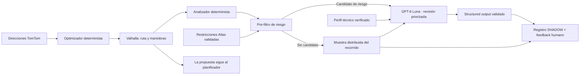

# Atlas Route Intelligence V1

## Estado y objetivo

La primera entrega funciona en modo `SHADOW`. TomTom resuelve direcciones, el optimizador determinista ordena paradas, Valhalla calcula el recorrido y Ferrostar conserva la navegación del conductor. Route Intelligence revisa con OpenAI cada propuesta válida y registra la evaluación sin modificar el trazado ni certificar que sea seguro. Cuando el resultado exige revisión humana, el usuario debe registrar aceptación o viabilidad antes de aplicar, guardar o simular la ruta; la interfaz y la RPC de guardado aplican la misma regla.

El límite es deliberado: `LEGAL`, `ROUTABLE`, `PHYSICALLY_POSSIBLE` y `OPERATIONALLY_REASONABLE` son propiedades distintas. Una respuesta del auditor nunca demuestra por sí sola las cuatro.

La geometría la calcula Valhalla. Cerca de un giro, el planificador puede probar un ajuste de acceso de hasta 20 m a una parada, verificar una conexión peatonal mapeada de hasta 30 m y conservarlo solo si el recorrido reduce maniobras o mejora el tiempo dentro del margen configurado. La propuesta muestra el punto original y el sugerido para revisión. La red peatonal no certifica que el cruce sea seguro. OpenAI revisa evidencia y explica riesgos; no genera coordenadas ni elige trazados.

## Arquitectura

`supabase/functions/atlas-route-intelligence` es una Edge Function independiente. Usa la API Responses con `store: false`, timeout de 10 segundos y structured output. La clave OpenAI existe solo en servidor. No se importa código de Psicolaboral ni se altera su proveedor. Se usa llamada HTTP directa en Deno: la evaluación del SDK `@openai/agents` encontró incompatibilidad entre su requisito actual de Deno y el runtime de Edge Functions de Supabase; no se instala un runtime ni se agrega una plataforma para justificar el SDK.

## Evidencia y comportamiento

- El analizador normaliza tipo de maniobra, bearings, ángulo, nombre vial y coordenadas que entrega Valhalla.
- Carriles, ancho, sentido, tráfico y restricciones permanecen desconocidos salvo que Atlas tenga evidencia validada. No se infieren dimensiones.
- El pre-filtro centraliza umbrales. Si encuentra riesgos, el modelo recibe hasta 20 maniobras priorizadas; si no encuentra, igualmente se llama al modelo con una muestra distribuida de hasta 20 maniobras de todo el recorrido. La respuesta informa cuántas maniobras revisó y el alcance usado.
- La API recibe el perfil de equipo opcional. Solo se considera verificado si un administrador entrega tipo y dimensiones críticas desde una fuente confirmada. Sin perfil verificado, `APPROVE` se transforma en `INSUFFICIENT_EVIDENCE`.
- Las restricciones operacionales se guardan como `PROPOSED`; una segunda acción explícita de un superadministrador puede validarlas. Solo filas `VALIDATED`, vigentes, compatibles por contrato/tipo y cercanas a la maniobra se incluyen en la auditoría.
- Datos de texto de mapas se consideran no confiables. El modelo no recibe herramientas que escriban reglas, cambien rutas o creen despachos.
- Si OpenAI, el perfil o la base de restricciones falla, el planificador vial continúa; el intento queda identificado como error/incompleto cuando se puede persistir. No se contabiliza como evaluación IA exitosa.
- Una propuesta sin alertas visibles no equivale a aprobación operacional. Sin candidatos de riesgo, se envía la muestra distribuida al modelo; un `APPROVE` solo describe la evidencia entregada y nunca certifica la ruta.

## Seguridad y persistencia

Migración `20261008004912_atlas_route_intelligence_shadow.sql` agrega perfiles de ruta, ejecuciones y feedback append-only, restricciones con estado y eventos de resolución. Todas las tablas tienen RLS y solo exponen lectura a superadministradores; escrituras usan RPC `SECURITY DEFINER` que comprueban `auth.uid()` y el rol actual. `anon` y DML directo quedan revocados. Los resultados/modelos/versiones/uso se guardan con clave idempotente; la evidencia mantiene límites de tamaño.

El modo se controla en Supabase Edge Function con `ATLAS_ROUTE_INTELLIGENCE_MODE`: `OFF` si no está definida y `SHADOW` para habilitar. Otros valores fallan cerrados. El endpoint requiere JWT y valida además el rol de superadministrador. La UI permite elegir un equipo solo como contexto de auditoría; no lo asigna al despacho.

## Operación, feedback y recuperación

La propuesta se muestra como provisional mientras corre la auditoría. Si falla, o si pide revisión humana y aún no hay feedback positivo, no se puede aplicar, guardar ni simular. Al cargar una ruta guardada, Valhalla vuelve a trazarla y Route Intelligence audita esa vista previa por separado; no se presenta una búsqueda de orden como si hubiera ocurrido. El panel presenta decisión, motivos, latencia, maniobras revisadas y feedback. Los overrides requieren motivo y quedan inmutables; el guardado y la creación/publicación del despacho vuelven a validar evidencia en PostgreSQL.

Desactivar inmediatamente configurando `ATLAS_ROUTE_INTELLIGENCE_MODE=OFF`. Las ejecuciones, restricciones y eventos son evidencia histórica; no borrarlos para hacer rollback. Para investigar: revisar logs de `atlas-route-intelligence`, categoría de error, idempotency/candidate hashes, versiones y `estimated_cost_usd` en `atlas_ops_route_intelligence_runs`.

## Restricciones conocidas y siguiente etapa

- Los U-turns continúan permitidos cuando Valhalla puede trazarlos; no se interpretan como marcha atrás ni se prohíben globalmente. Una alternativa solo reemplaza el tramo si mejora duración del recorrido completo; no se toma una ruta más lenta solo para eliminar un giro en U. Los datos del mapa no certifican radio de giro o espacio físico.
- La búsqueda del orden de paradas evalúa un conjunto acotado de hasta ocho órdenes alternativos, más el orden base, los traza de nuevo con Valhalla y elige el más rápido entre los trazados válidos. No equivale a explorar todas las permutaciones ni garantiza el óptimo global. Si no hay mejora comprobada, se conserva el mejor candidato trazado y se informa cuántos se evaluaron.
- Una ruta histórica que no tenga auditoría OpenAI ligada a sus paradas permanece en el catálogo para consulta, pero PostgreSQL bloquea su uso en un nuevo despacho hasta planificar y guardar una versión evaluada. La auditoría de un despacho considera también feedback positivo cuando la IA solicita revisión humana.
- Las restricciones tienen RPC segura y audit trail. La gestión inicial se realiza por RPC con rol superadministrador; aún falta una pantalla administrativa dedicada.
- El perfil dimensional no se llena desde patentes o tipo de flota. Debe cargarse desde una fuente técnica confiable.
- Tráfico, señalización y restricciones de faena no están conectados salvo las restricciones Atlas validadas.
- La búsqueda de cambios de trazado local por una o dos cuadras todavía no forma parte de esta versión. Las alternativas de orden cambian la secuencia de paradas; no generan puntos de acceso o geometrías alternativas alrededor de cada parada.
- No se midieron tiempos productivos ni se generó corpus real de operación. La IA audita y solicita revisión, mientras Valhalla calcula y busca entre candidatos acotados; no se garantiza una mejora cuando no existe una alternativa demostrablemente superior. El LLM no inventa geometría ni decide una ponderación opaca entre minutos y maniobras.

## Validación y fixture

Ejecutar `npm run test:unit -- tests/unit/atlas-route-intelligence.test.ts`, typecheck `node ./node_modules/typescript/bin/tsc --noEmit -p tsconfig.app.json`, `deno check --no-config --node-modules-dir=none supabase/functions/atlas-route-intelligence/index.ts`, las mismas comprobaciones para `atlas-tomtom-planning/index.ts`, `npm run build:frontend-check`, auditorías Supabase/Guardian y `git diff --check`.

El fixture crítico de unit tests cubre un giro de casi 180 grados para un bus. Debe elevarse para auditoría sin inventar ancho vial, tráfico ni una conclusión de maniobra físicamente posible. Los tests de integración con credenciales deben correrse en un ambiente controlado antes de habilitar SHADOW en producción.
